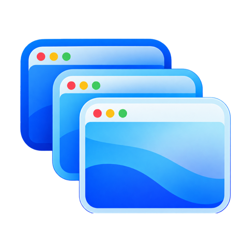
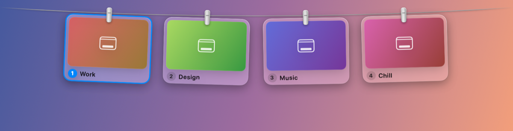
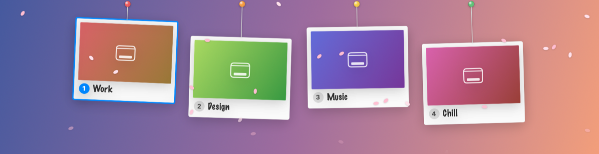
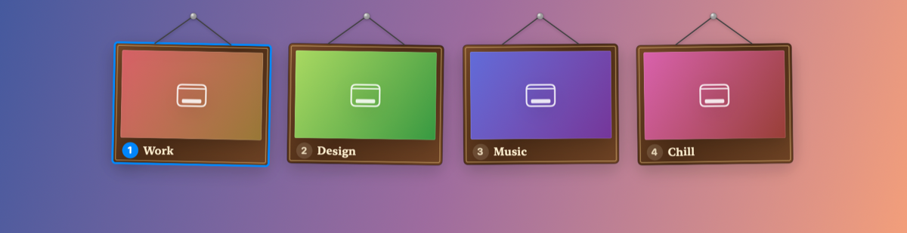
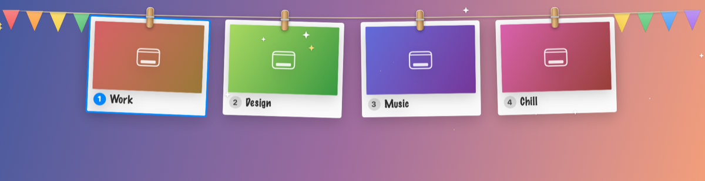
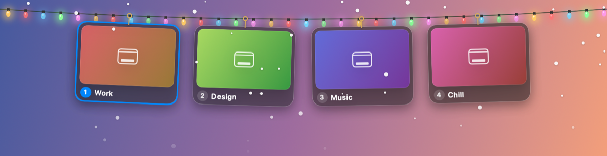
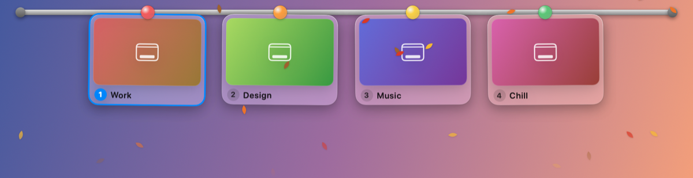

<p align="center"></p>

<h1 align="center">iDesk</h1>

<p align="center"><b>Name your Mac desktops and hang them under the menu bar.</b><br>Every desktop (Space) hangs on a line with a live preview and its own name. Click one to go there.</p>

<p align="center"></p>

iDesk is a menu bar app written in Swift with SwiftUI, AppKit, and ScreenCaptureKit, built from the same Capture Line that iSnap uses for screenshots.

## Highlights

### Name every desktop

macOS calls them "Desktop 1, 2, 3…" and has no way to rename them. iDesk keeps your names (Work, Design, Music…) keyed by each Space's UUID, so a name follows its desktop even after you reorder desktops in Mission Control. Rename from the line (the pencil on a card, or right-click), from the menu bar, from Settings, or with `⌃⌥R` for the desktop you are on. The menu bar shows the current desktop's name.

### The Desktop Line

Rest the pointer in the menu bar and the line slides down with every desktop on that display, each with a picture of what is on it. Click a card to switch there. Choose **Show on Hover**, **Always Show**, or **Only with Shortcut**, and toggle it any time with `⌃⌥D`. The line steps aside over full screen apps.

### Add and delete desktops

Right-click a card, use the menu bar's **Add Desktop** and **Delete Desktop**, or the buttons in **Settings → Desktops**. Deleting asks first; the desktop's windows move to another one. The desktop you are on, the last desktop on a display, and full screen apps cannot be deleted.

### Screens for streaming and presenting

With more than one screen connected, the menu bar's **Screens** submenu and **Settings → Screens** choose which screens are on: **All Screens On**, **Main Screen Only**, **Only <screen>** (one choice per external screen), or each screen on and off by itself. iDesk never changes what a screen shows or its resolution.

Turning a screen off asks you to keep the change and undoes it after 15 seconds without an answer, in case the dialog ended up on a dark screen. `⌃⌥⌘D` turns every screen back on, and so do quitting iDesk and logging out.

### Six ways to hang

| | |
| --- | --- |
| **Clothesline**: a sagging rope with aluminium clips | **Strings**: pinned threads of different lengths, swinging like pendulums |
|  |  |
| **Picture Frames**: wooden frames on nails | **Bunting**: polaroids on a rope of pennants, held by wooden pegs |
|  |  |
| **Fairy Lights**: twinkling bulbs with brass hooks | **Magnetic Rail**: a steel rail with coloured magnets |
|  |  |

### Effects

- **Sway**: Still, Gentle Breeze, or Windy (constant sway with gusts)
- **Switch effect** on the desktop you arrive on: Swing, Bounce, Spin, Glow, or None
- **Particles** drifting from the line: Snow, Sparkles, Cherry Petals, or Autumn Leaves
- **Name banner** after each switch: a Hanging Sign that drops and swings on its strings, or a Glass Pill
- Cards drop in and swing when the line comes down, and lean over when hovered

Everything is in the menu bar icon's menu and in **Settings → Look**, which has a live preview.

### And more

- Full screen apps can hang on the line too (off by default)
- Multiple displays, with or without "Displays have separate Spaces"
- English and Tiếng Việt interface, launch at login, optional switch sound

## How it works, and its limits

macOS has no public API for Spaces, so iDesk works the way other Spaces utilities do:

- **Reading desktops** uses the window server's private `CGSCopyManagedDisplaySpaces` call, the same call iSnap uses to detect full screen apps. It needs no permission.
- **Names live in iDesk.** They appear in iDesk's line, menu, and banner. Mission Control and the system itself still show "Desktop 1, 2, 3…"; no app can change that.
- **Switching** presses the Mission Control shortcuts for you, which needs **Accessibility** access. If "Switch to Desktop N" is enabled in System Settings → Keyboard → Keyboard Shortcuts → Mission Control, iDesk jumps straight there; otherwise it walks with ⌃← / ⌃→ (on by default). iDesk reads your actual shortcuts from `com.apple.symbolichotkeys`.
- **Previews** need **Screen Recording** access (optional). macOS cannot show a desktop you are not on, so each picture is taken while you are on that desktop and refreshed every 20 seconds while you stay. Visit each desktop once after installing. Without the permission, the wallpaper stands in. iDesk's own windows are left out of the pictures, and the pictures stay on your Mac in `~/Library/Caches/dev.idesk.app`.

- **Adding and deleting desktops** uses Mission Control's own buttons through Accessibility (the approach of Hammerspoon's `hs.spaces`): iDesk opens Mission Control for a moment, presses the button, and closes it. If Mission Control does not show its buttons to iDesk, iDesk says so and offers to open Mission Control so you can do it by hand.
- **Turning a screen off** uses the window server's private `CGSConfigureDisplayEnabled`, as display utilities do; every change lasts for the login session only.

## Requirements

- macOS 14 Sonoma or later
- Accessibility access to switch desktops; Screen Recording access for previews (optional)
- To build: Xcode 16 or later and [XcodeGen](https://github.com/yonaskolb/XcodeGen)

## Install and build

```bash
swift build
swift test
```

Build the app with Xcode:

```bash
xcodegen generate
xcodebuild -project iDesk.xcodeproj -scheme iDesk -configuration Release build
```

Copy the built `iDesk.app` to `/Applications` and open it; it lives in the menu bar. Set your Apple Development team in `project.yml` (`DEVELOPMENT_TEAM`) and always run the copy in Applications, so macOS keeps the Accessibility and Screen Recording permissions between builds.

The logo is `docs/assets/logo-source.png`. `scripts/make-icon.sh [logo.png]` cleans it up, fits it to the macOS icon grid, fills `Assets.xcassets` with every app icon size and writes `docs/assets/idesk-logo.png` for the docs.

Images of every hanging style are rendered from the real views:

```bash
IDESK_SHOTS_DIR=/tmp/idesk-shots swift test --filter StyleShotsTests
```

## Architecture

iDesk follows MVVM. Views only draw view model state and send intents back; view models hold the app's logic and never touch AppKit windows or alerts; services wrap the system.

```text
Sources/iDesk
├── App          iDeskApp (entry point, AppDelegate), AppEnvironment (builds services and view models)
├── Models       DesktopSpace + SpaceLayout, AppSettings, HangingDesktop + LineLook,
│                DisplayArrangement + DisplayLayout, AppLanguage
├── ViewModels   DesktopsViewModel     desktops, names, previews, switching, renaming (shared)
│                DesktopLineViewModel  what hangs on the line, its look, reveal state, effects
│                NameBannerViewModel   the name shown after a switch
│                MenuBarViewModel      menu bar title, desktop list and option groups
│                DisplaysViewModel     which screens are on, confirm-or-undo
│                SettingsViewModel     everything the Settings window edits
│                DialogPresenting      the questions view models ask the user
├── Services     SpaceService, SpaceSwitcher, MissionControlService, DisplayService,
│                ThumbnailStore, PermissionService, HotkeyService,
│                SettingsStore, LaunchAtLoginService, AppRelauncher
└── Views
    ├── Line       DesktopLineView, LineDecor, LineLayout, DesktopLineWindowController
    ├── Banner     NameBannerView, NameBannerWindowController
    ├── MenuBar    MenuBarController
    ├── Settings   SettingsView, SettingsWindowController
    └── Dialogs    AlertDialogs
```

`DesktopsViewModel` is the hub: it publishes `arrivals` (a desktop was switched to) and `highlights` (a card should play its effect), and every other view model builds on it. Services and dialogs are passed in, so the view models are tested with fixed Spaces and scripted answers (`Tests/iDeskTests/ViewModelTests.swift`).

## License

The Desktop Line's rope, clips, swing and hover reveal are adapted from [Tendedero](https://github.com/alejandrobujan/tendedero) (MIT) by way of iSnap; its license notice is kept at the top of `Sources/iDesk/Views/Line/DesktopLineView.swift`.
